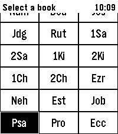
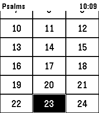
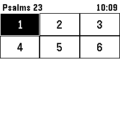
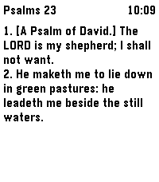
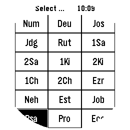
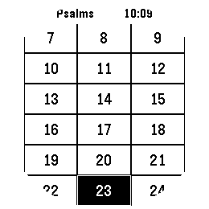
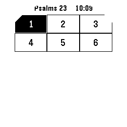
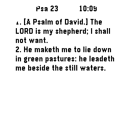

# Bibble App Store Listing

## Listing Metadata

- Name: `Bibble`
- Version: `0.2.0`
- Category: `Tools & Utilities`
- Release: `Public`
- Support Email: `nick.b.ludwig@proton.me`
- Source: `https://github.com/nick1udwig/bibble`

## App Icon

Use [`assets/bibble-icon.png`](../assets/bibble-icon.png) for the store icon submission.

## Listing Text

Read the King James Bible on Repebble core devices. Choose Gothic 14, 18, or 24 in regular or bold for scripture and headers, while large bold selection grids keep navigation clear. Bibble downloads the KJV text into PebbleKit JS on startup, then streams and caches pages for smooth watch-side reading without bundling the full Bible in the watch app.

## Example Screens

Four high-impact screens are captured for each supported platform: book grid, chapter grid, verse grid, and reader. These captures use Gothic 18 Bold for the reader and headers; selection grids use their fixed Gothic 24 Bold profile.

### Emery

1. 
2. 
3. 
4. 

### Gabbro

1. 
2. 
3. 
4. 
